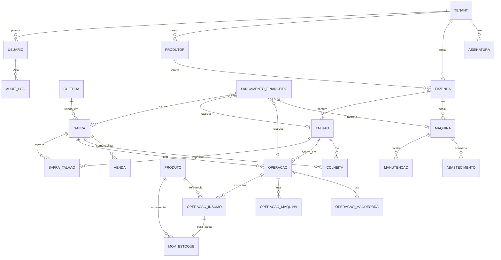

# 02 — Modelo de Dados

> Modelagem das entidades, relacionamentos, multi-tenant, auditoria e rastreabilidade de custo. Base para o `schema.prisma`.

---

## 1. Hierarquia conceitual

```
TENANT (empresa/cliente SaaS)
  └── PRODUTOR (proprietário/cliente rural)
        └── FAZENDA (propriedade)
              └── TALHÃO (área de plantio)
                    └── SAFRA (ciclo cultura + período)
                          └── OPERAÇÃO (plantio, pulverização…)
                                └── consome → INSUMO / MÁQUINA / MÃO DE OBRA
                          └── COLHEITA → PRODUÇÃO
                          └── COMERCIALIZAÇÃO → VENDA
                          └── = RESULTADO FINANCEIRO
```

**Rastreabilidade:** todo `LancamentoFinanceiro` e todo custo de operação carrega referências opcionais a `safraId`, `talhaoId`, `operacaoId`, `maquinaId`. Isso permite responder "quanto custou o Talhão T-03?" com um simples agregado filtrado.

---

## 2. Diagrama de entidades (visão geral)



---

## 3. Entidades principais

### Núcleo SaaS / Acesso
- **Tenant** — empresa cliente. `id, nome, documento, plano, status, criadoEm`.
- **Assinatura** — `tenantId, plano, status, inicio, fim, limites`.
- **Usuario** — `id, tenantId, nome, email, senhaHash, perfil, ativo`.
- **Perfil / Permissao** — RBAC (admin, proprietário, gerente, agrônomo, operador, financeiro, consulta).
- **Convite** — onboarding de usuários no tenant.

### Cadastros rurais
- **Produtor** — `tenantId, nome, documento, contato`.
- **Fazenda** — `tenantId, produtorId, nome, documento, municipio, estado, areaTotal, areaProdutiva, localizacao(geo), observacoes`.
- **Talhao** — `tenantId, fazendaId, codigo, nome, area, culturaAtualId?, safraAtualId?, status, geometria(geojson, fase futura)`.
- **Cultura** — `tenantId?, nome, unidadeProducao (sc, t), cicloDias` (culturas base podem ser globais).

### Safra e operações
- **Safra** — `tenantId, culturaId, nome(2026/2027), status, dataInicio, dataFim, precoVendaPrevisto`.
- **SafraTalhao** — associação N:N safra↔talhão com `areaPlantada, produtividadeEstimada`.
- **Operacao** — `tenantId, safraId, talhaoId, tipo (preparo|plantio|adubacao|pulverizacao|irrigacao|colheita|outra), data, area, custoTotal, status, observacoes`.
- **OperacaoInsumo** — `operacaoId, produtoId, dose, unidade, quantidadeTotal, custoUnitario, custoTotal`.
- **OperacaoMaquina** — `operacaoId, maquinaId, horas, custoHora, custoTotal`.
- **OperacaoMaoDeObra** — `operacaoId, descricao, horas, custoHora, custoTotal`.

### Estoque
- **Produto** — `tenantId, nome, categoria (insumo|fertilizante|defensivo|semente|combustivel|peca|outro), unidade, estoqueAtual, estoqueMinimo, custoMedio, localArmazenamento, lote, validade`.
- **MovimentacaoEstoque** — `tenantId, produtoId, tipo (entrada|saida|consumo|ajuste|transferencia), quantidade, custoUnitario, origemTipo, origemId, data, usuarioId`.
  - Uma pulverização gera `MovimentacaoEstoque` do tipo `consumo` ligada à `OperacaoInsumo`.

### Máquinas
- **Maquina** — `tenantId, fazendaId, nome, tipo (trator|colheitadeira|pulverizador|implemento|veiculo), horimetro, quilometragem, proximaManutencaoEm`.
- **Manutencao** — `tenantId, maquinaId, data, tipo, descricao, custo, horimetroNaData`.
- **Abastecimento** — `tenantId, maquinaId, data, litros, custoLitro, custoTotal, horimetroNaData`.

### Colheita e comercialização
- **Colheita** — `tenantId, safraId, talhaoId, produto, data, quantidade, unidade, umidade, perdas, destino, armazenamento`.
- **Venda** — `tenantId, safraId, clienteId, produto, quantidade, precoUnitario, precoSaca, contrato, frete, descontos, data, entrega, recebimento, status`.
- **Cliente** — `tenantId, nome, documento, contato`.
- **Fornecedor** — `tenantId, nome, documento, contato`.

### Financeiro
- **LancamentoFinanceiro** — `tenantId, tipo (pagar|receber), descricao, valor, vencimento, pagamento?, status, categoriaId, centroCustoId, fornecedorId?, clienteId?, safraId?, talhaoId?, operacaoId?, maquinaId?`.
- **CategoriaFinanceira** — `tenantId, nome, tipo`.
- **CentroCusto** — `tenantId, nome` (pode espelhar fazenda/safra/talhão).

### Transversais
- **Alerta** — `tenantId, tipo (estoque|manutencao|financeiro|operacao|custo|producao), nivel (info|atencao|critico), titulo, descricao, entidadeTipo, entidadeId, lido, criadoEm`.
- **AuditLog** — `tenantId, usuarioId, acao, entidade, registroId, valorAnterior(json), valorNovo(json), criadoEm`.

---

## 4. Transação: registrar uma operação agrícola

Exemplo da spec (pulverização, 42,7 ha × 2 L/ha = 85,4 L). Tudo numa transação atômica:

```
BEGIN
  1. cria Operacao (tipo=pulverizacao, area=42,7)
  2. cria OperacaoInsumo (produto=Herbicida X, dose=2, qtd=85,4, custo)
  3. cria MovimentacaoEstoque (tipo=consumo, qtd=-85,4, ligada à OperacaoInsumo)
  4. atualiza Produto.estoqueAtual (-85,4) e recalcula custo
  5. calcula Operacao.custoTotal (insumo + máquina + mão de obra)
  6. custo fica rastreável via talhaoId + safraId na própria operação
  7. cria AuditLog (acao=CRIAR_OPERACAO, valores)
  8. se estoque < mínimo → cria Alerta
COMMIT   (qualquer erro → ROLLBACK total)
```

Implementado em `modules/operacoes/services/registrarOperacao.ts` com `prisma.$transaction`.

---

## 5. Consultas de negócio que o modelo garante

| Pergunta | Como |
|---|---|
| Quanto custou a safra? | `SUM(custo)` de operações + lançamentos `where safraId` |
| Quanto custou o Talhão T-03? | agregado `where talhaoId` |
| Quanto gastamos com fertilizante? | agregado por `Produto.categoria = fertilizante` |
| Quanto gastamos com máquinas? | soma de `OperacaoMaquina` + `Manutencao` + `Abastecimento` |
| Quanto custa produzir uma saca? | custo total da safra ÷ produção (sc) |
| Custo/ha do talhão | custo acumulado ÷ área |
| Margem se vender a R$X/saca | (produção × X) − custo total |

---

## 6. Regras de integridade

- Toda entidade de negócio tem `tenantId NOT NULL` + índice.
- Exclusões sensíveis são **soft delete** (`deletadoEm`) + `AuditLog`.
- Valores monetários e quantidades: `Decimal` (não float) para evitar erro de arredondamento.
- Datas em UTC; exibição no fuso do usuário.
- `MovimentacaoEstoque` é a **fonte da verdade** do saldo; `Produto.estoqueAtual` é cache recalculável.

---

## 7. Auditoria

Registrar em `AuditLog` toda ação sobre: **estoque, financeiro, operações, colheita, configurações e exclusões**. Campos: usuário, data/hora, ação, entidade, registro, valor anterior, valor novo. Implementado como helper chamado dentro dos services (não como trigger escondida), para ficar explícito e testável.
